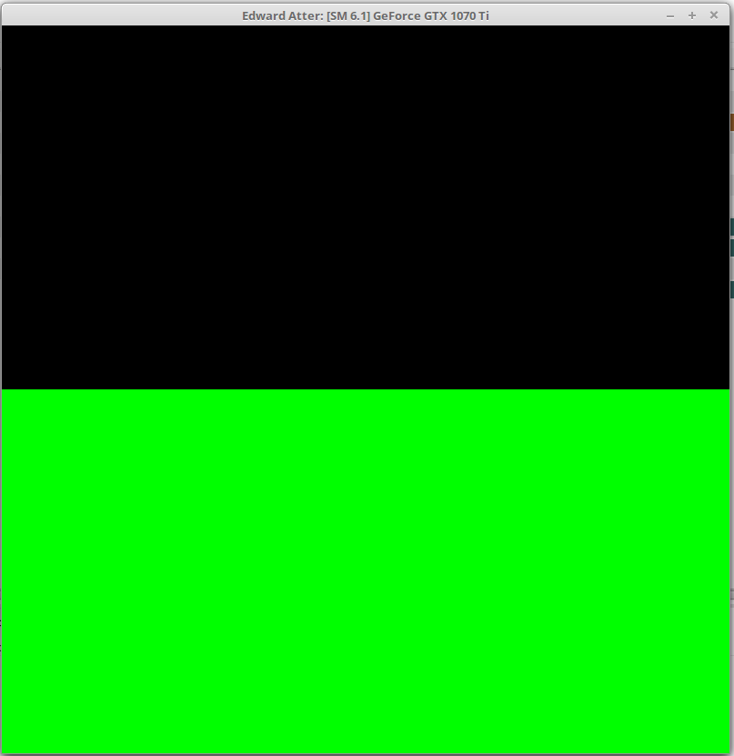
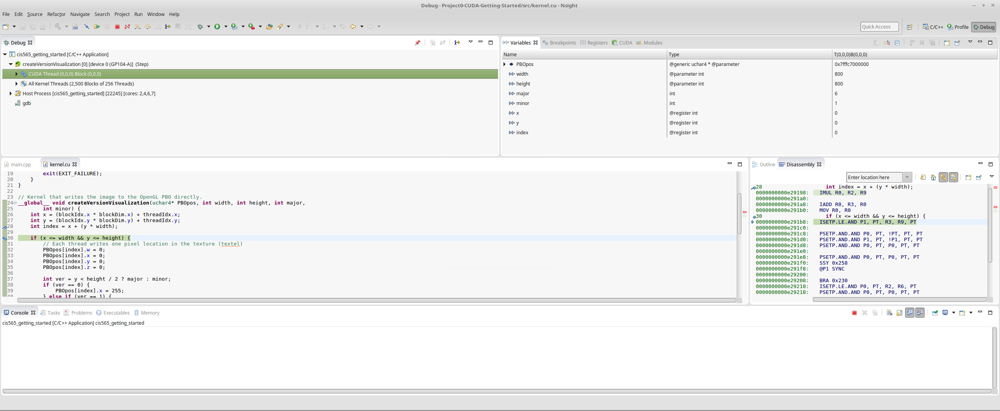
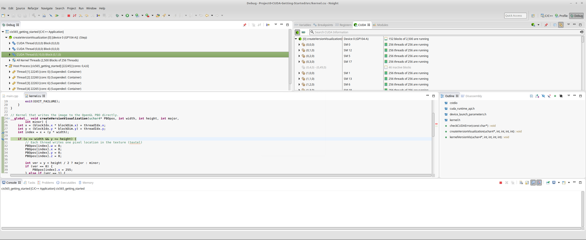

Project 0 CUDA Getting Started
====================

**University of Pennsylvania, CIS 565: GPU Programming and Architecture, Project 0**

* Edward Atter
  * [LinkedIn](https://www.linkedin.com/in/atter/)
  * Tested on: Linux Mint 18.3 Sylvia (4.13.0-41-generic), Ryzen 7 2700x @ 3.7 ghz (base clock) 16GB, GTX 1070 TI 8GB GDDR5 (Personal)

### Project Information

#### Modify

#### Analyze

#### Debug (CUDA-GDB on Linux)

Debugger works after adding `export CUDA_DEBUGGER_SOFTWARE_PREEMPTION=1` to `~/.bashrc`.

#### Edits to CMakeLists.txt

TODO
